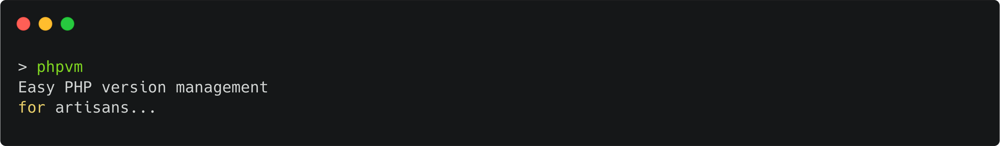

[](https://github.com/Thavarshan/phpvm)

[](https://github.com/Thavarshan/phpvm/actions/workflows/test.yml)
[](https://github.com/Thavarshan/phpvm/actions/workflows/use.yml)
[](https://github.com/Thavarshan/phpvm/releases)
[](https://github.com/Thavarshan/phpvm/stargazers)

# PHP Version Manager (phpvm)

## Introduction

`phpvm` is a lightweight PHP Version Manager that allows you to easily install, switch between, and manage multiple PHP versions via the command line.

**Example:**

```sh
$ phpvm use 8.2
Switching to PHP 8.2...
Switched to PHP 8.2.
$ php -v
PHP 8.2.10
$ phpvm use 8.1
Switching to PHP 8.1...
Switched to PHP 8.1.
$ php -v
PHP 8.1.13
```

## Features

- Install and manage multiple PHP versions.
- Seamlessly switch between installed PHP versions.
- Auto-switch PHP versions based on project `.phpvmrc`.
- Supports macOS (via Homebrew) and Linux distributions.
- Works with common shells (`bash`, `zsh`).
- Improved error handling with detailed messages and suggestions.
- Informative, color-coded feedback with timestamps for logs.
- Includes unit tests with BATS for automated testing.
- Helper functions for better maintainability and reduced code duplication.

## Installation

### Install & Update phpvm

To **install** or **update** phpvm, run one of the following commands:

```sh
curl -o- https://raw.githubusercontent.com/Thavarshan/phpvm/main/install.sh | bash
```

```sh
wget -qO- https://raw.githubusercontent.com/Thavarshan/phpvm/main/install.sh | bash
```

This script will download and set up `phpvm` in `~/.phpvm` and automatically update your shell profile (`~/.bashrc`, `~/.zshrc`, or `~/.profile`) with the following lines:

```sh
export PHPVM_DIR="$HOME/.phpvm"
export PATH="$PHPVM_DIR/bin:$PATH"
[ -s "$PHPVM_DIR/phpvm.sh" ] && . "$PHPVM_DIR/phpvm.sh"
```

### Verify Installation

Run the following command:

```sh
command -v phpvm
```

If the installation was successful, it should output the path to `phpvm`.

## Usage

### Installing PHP Versions

To install a specific version of PHP:

```sh
phpvm install 8.1
```

### Switching PHP Versions

To switch between installed versions:

```sh
phpvm use 8.0
```

To switch back to the system PHP version:

```sh
phpvm system
```

Verify the active version with:

```sh
php -v
```

### Auto-Switching PHP Versions

Create a `.phpvmrc` file in your project directory to specify the desired PHP version:

```sh
echo "8.1" > .phpvmrc
```

When you navigate to that project directory and run:

```sh
phpvm auto
```

phpvm will automatically detect and switch to the version specified in the `.phpvmrc` file.

### Listing Installed Versions

To list all installed PHP versions:

```sh
phpvm list
```

This will show all installed PHP versions and indicate the currently active one.

### Running Self-Tests

phpvm includes built-in self-tests to verify everything is working correctly:

```sh
phpvm test
```

This will run a series of tests on your system to ensure all phpvm functions are working properly.

## Uninstallation

To completely remove `phpvm`, run:

```sh
rm -rf ~/.phpvm
```

Then remove the following lines from your shell profile (`~/.bashrc`, `~/.zshrc`, or `~/.profile`):

```sh
export PHPVM_DIR="$HOME/.phpvm"
export PATH="$PHPVM_DIR/bin:$PATH"
[ -s "$PHPVM_DIR/phpvm.sh" ] && . "$PHPVM_DIR/phpvm.sh"
```

## Troubleshooting

If you experience issues with `phpvm`, try the following:

- Run `phpvm test` to verify all functions are working correctly
- Ensure your shell profile is sourcing `phpvm.sh`
- Restart your terminal after installing or updating
- Verify that the required package manager is installed:
  - Homebrew for macOS
  - apt, dnf, yum, or pacman for Linux
- Check for permission issues during the installation or PHP version switching process
- For Linux systems, you may need to use `sudo` for installation and switching
- Refer to the [Changelog](./CHANGELOG.md) for recent updates and fixes

## Development & Testing

- This project includes a set of BATS unit tests located in the repository (e.g., `test_phpvm.bats`).
- Contributions, bug reports, and feature requests are welcome.
- The codebase now includes helper functions for better maintainability and reduced duplication.

### Testing

phpvm includes built-in self-tests that validate all core functionality:

```sh
# Run the built-in tests
phpvm test
```

The test framework verifies:

- Output and formatting functions
- System detection
- PHP version installation (mocked)
- Version switching
- Auto-switching based on .phpvmrc
- System PHP integration

These tests can be run in any environment with a shell and don't require external testing frameworks.

### Debugging

To enable debug output, set the `DEBUG` environment variable to `true`:

```sh
DEBUG=true phpvm install 8.1
```

## Maintainers

`phpvm` is maintained by [Jerome Thayananthajothy](https://github.com/Thavarshan).

## License

This project is licensed under the MIT License. See [LICENSE](./LICENSE) for details.

## Disclaimer

`phpvm` is provided as-is without any warranties. Use it at your own risk.
